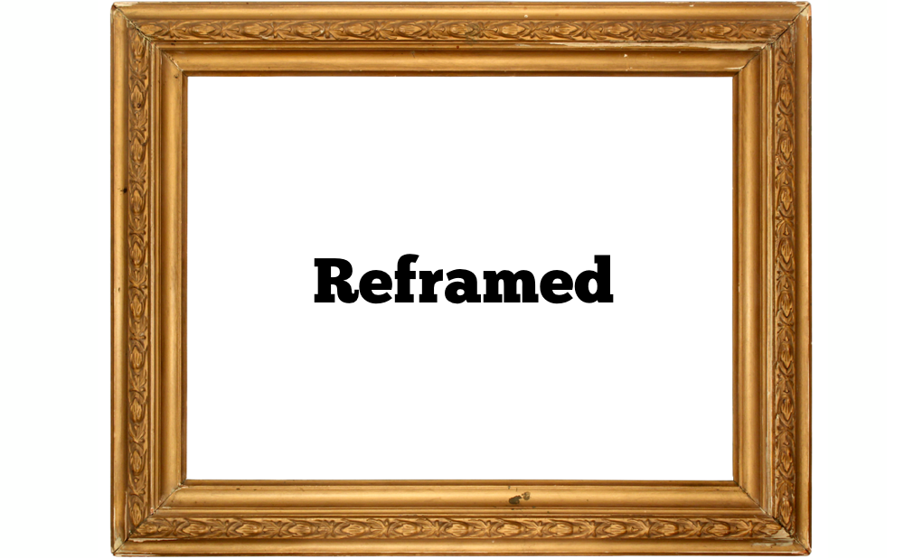

---
# You don't need to edit this file, it's empty on purpose.
# Edit theme's home layout instead if you wanna make some changes
# See: https://jekyllrb.com/docs/themes/#overriding-theme-defaults
layout: home2
---

 <a class="twitter-timeline" href="https://twitter.com/ReframedRCT" data-widget-id="461839004430647296">Tweets by @ReframedRCT</a>

